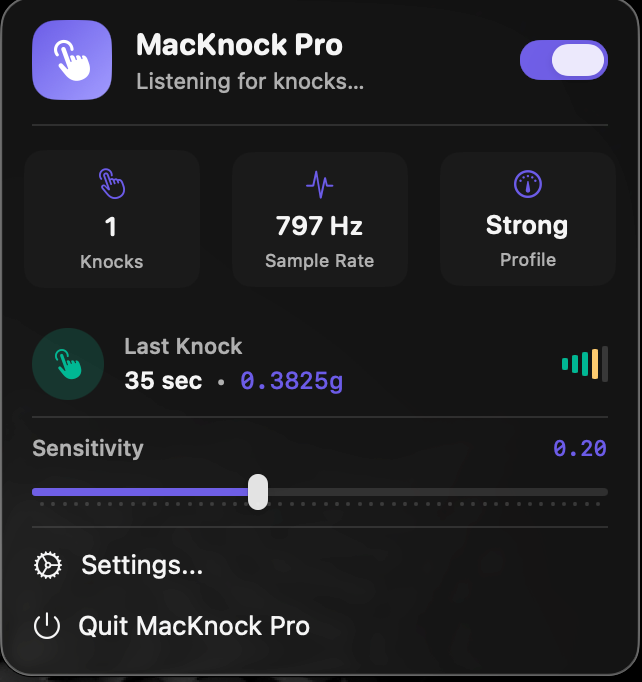
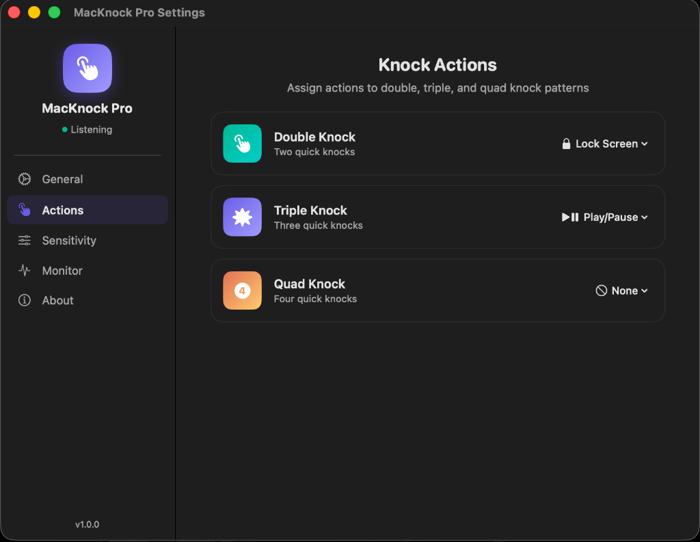
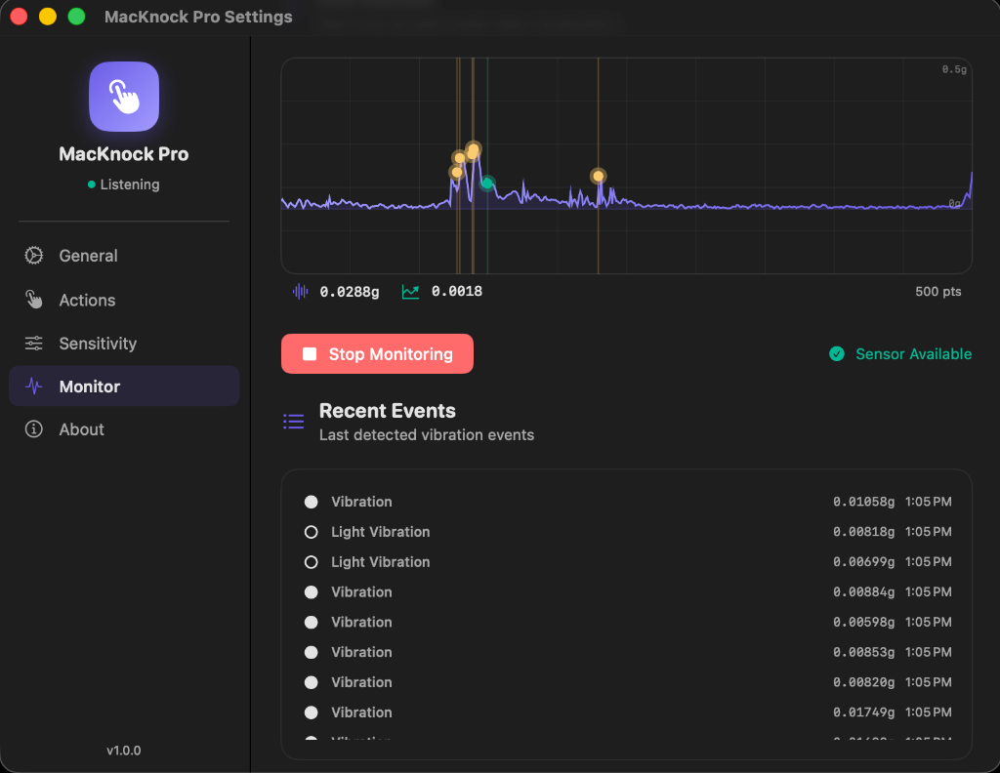
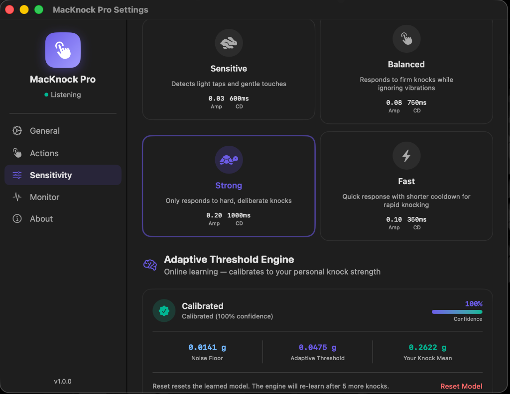
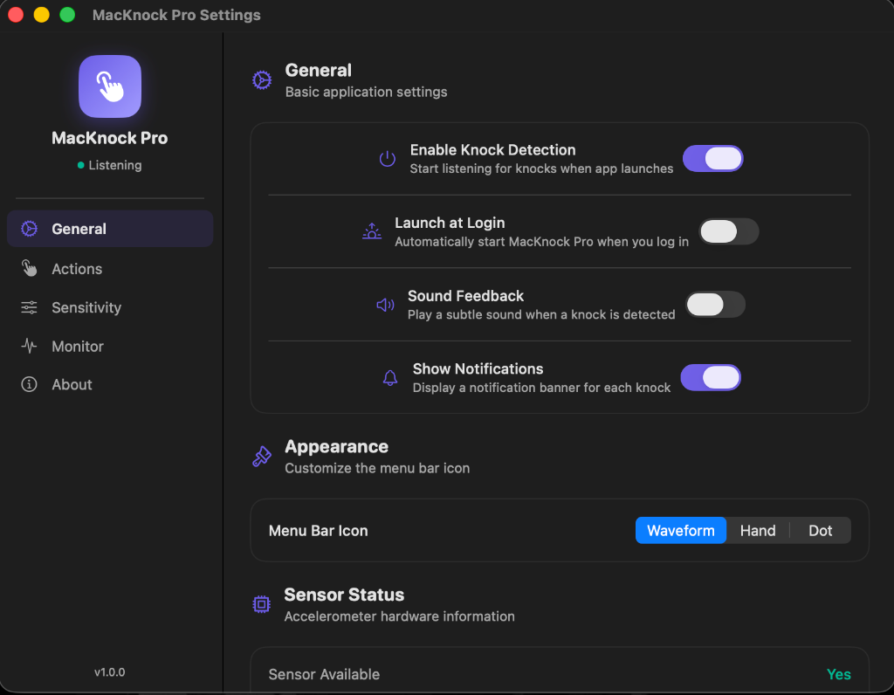

# MacKnock Pro 🤜💻

Ever wanted to just knock on your MacBook to pause your music or lock your screen? **MacKnock Pro** turns your Mac's chassis into a giant, customizable button. 

By tapping into the hidden accelerometer inside modern Apple Silicon Macs, this app detects physical knocks in real-time using undocumented IOKit magic. 

<p align="center">
  
</p>

---

## ✨ What It Can Do

* 🎵 **Control Your Tunes:** Play/Pause, skip tracks, or tweak the volume without finding the right keys.
* 🔒 **Lock It Down:** Quickly lock your screen, grab a screenshot, or toggle Do Not Disturb.
* 🤖 **Make It Yours:** Map knocks to launch apps, run Apple Shortcuts, or execute custom shell scripts.
* 🎯 **Pattern Recognition:** Set up different actions for double, triple, and even quadruple knocks.
* 📊 **See the Vibes:** A live, real-time waveform monitor lets you actually see the accelerometer data.
* 🎨 **Sleek UI:** Everything is managed from a clean, native menu bar popover and settings window.



---

## 🛠️ What You Need

Before you dive in, make sure your setup checks these boxes:

* **macOS 14.0+** (Sonoma)
* **An Apple Silicon Mac** (M2, M3, M4, or M5). *Note: Base M1 models are not supported.*
* **Root privileges (`sudo`)** to access the accelerometer.

> **Note:** Because we are poking around in undocumented IOKit HID interfaces, this app isn't allowed on the Mac App Store. 

---

## 🧠 Under the Hood (For the Geeks)

Curious how it actually knows you knocked? Here is the pipeline:

1.  **The HID Bridge:** We open `AppleSPUHIDDevice` on vendor usage page `0xFF00`, usage `3` (the accelerometer).
2.  **Raw Data Parsing:** The app grabs 22-byte reports, finding the `int32` x/y/z coordinates at byte offset 6, and scales them down (`/65536`) to get standard g-force.
3.  **The Math:** We run four detection algorithms simultaneously to make sure a knock is actually a knock:
    * **STA/LTA** (Short/Long-Term Average) checking three different timescales.
    * **CUSUM** (Cumulative Sum) to spot sudden shifts.
    * **Kurtosis** to catch sharp, impulsive spikes (if kurtosis > 6, it's a knock!).
    * **Peak/MAD** (Median Absolute Deviation) to filter out outliers.
4.  **Pattern Buffering:** The app holds onto your knocks for a split second to see if you're going for a double, triple, or quad combo.



---

## 🎛️ Tuning the Sensitivity

Everyone types differently, and every desk is built differently. MacKnock Pro uses an adaptive machine-learning engine to learn your habits, but you can manually tweak the baseline to fit your style.



### The Presets

* **Sensitive:** Detects light taps and gentle touches. Perfect if you type lightly and want effortless triggering, but be warned: heavy typing might trigger it by accident!
* **Balanced:** The default sweet spot. It catches firm knocks but ignores normal typing and aggressive trackpad clicks.
* **Strong:** Only responds to deliberate, physical thumps. Choose this if you're a heavy typist or if you use a mechanical keyboard on the same desk.
* **Fast:** Super quick response times. Designed for folks who rapid-fire their double and triple knocks.

### Getting Granular (The Sliders)

If the presets aren't quite hitting the mark, you can adjust the math yourself:

* **Noise Guard Floor (Amplitude):** This is the absolute minimum force required for the app to care. 
    * *Slide Left:* Lowers the floor. It will pick up very subtle finger taps.
    * *Slide Right:* Raises the floor. It will completely ignore light taps, furious typing, or accidental desk bumps.
* **Cooldown Period (Time Window):** How long the app waits after your first knock to see if another one is coming.
    * *Slide Left:* Short window. You have to tap incredibly fast, but your actions will trigger almost instantly.
    * *Slide Right:* Long window. You can pace your knocks casually, but the app takes a moment to "lock in" your final knock before executing the action.

---

## 🚀 Building & Running

### 1. Build the App
1. Open `MacKnock Pro.xcodeproj` in Xcode 15 or newer.
2. Select the "MacKnock Pro" scheme and hit **Build & Run (⌘R)**.
3. Find your compiled `.app` file (Right-click it under Xcode's "Products" folder -> **"Show in Finder"**).

### 2. Run with Root Privileges
Because accessing raw hardware sensors is heavily restricted by macOS, **you cannot just double-click the app icon**. If you do, the UI will open normally, but it will silently fail to detect your knocks. You must run the core executable via Terminal using `sudo`.

1. Open the **Terminal** app and type `sudo ` (make sure to include the space).
2. Right-click your `MacKnock Pro.app` in Finder, choose **"Show Package Contents"**, and navigate to `Contents/MacOS/`.
3. **Drag and drop** the `MacKnock Pro` executable file straight into your Terminal window. This automatically types out the complex file path for you!
4. Hit **Enter**, type your Mac password (the characters will be hidden), and hit Enter again.

The final command in your terminal should look something like this:
```bash
sudo /path/to/MacKnock\ Pro.app/Contents/MacOS/MacKnock\ Pro
```
## ⚙️ Settings



## 🙏 Credits & Open Source Love

This project wouldn't be possible without:
* [olvvier/apple-silicon-accelerometer](https://github.com/olvvier/apple-silicon-accelerometer) for the IOKit interface and sensor reading.
* [taigrr/spank](https://github.com/taigrr/spank) for the brilliant vibration detection algorithms.


---

## 📄 License

**MIT License** — Have fun, break things, and make it your own!
